# Cosmo Linux マイルストーン: パッケージ管理とプログラム実行

## 現状 (v0.1.0)

| カテゴリ | 実装済み |
|---------|---------|
| **FS** | RamFS, DevFS, ProcFS, Pipe, VFS, FDテーブル |
| **Exec** | ELF64パーサ, PT_LOADローダ (RamFS→メモリマップ) |
| **Syscall** | 17種: read/write/open/close/exit/fork/getpid/getppid/kill/wait4/uname/getcwd/chdir/brk/mmap/munmap/pipe/dup2 |
| **MM** | Buddy PMM, 4-level VMM, SLAB kmalloc, VMA mmap |
| **Net** | virtio-net, ARP, ICMP ping, DNS解決, UDP |
| **ストレージ** | なし (揮発性RamFSのみ) |

## ゴール

`cosmo:/$ brew install hello` → パッケージダウンロード → ELF実行

---

## Milestone 1: ホストファイルシステム共有 (virtio-9p)

QEMUの9P/virtio-9pでホストディレクトリをゲストにマウント。これにより永続ストレージなしでホスト上のファイルにアクセス可能。

| 項目 | 内容 |
|------|------|
| **drivers/virtio_9p.cm** | 9Pプロトコルクライアント (Tattach, Twalk, Topen, Tread, Twrite) |
| **fs/9pfs.cm** | VFS統合 (mount, lookup, read, write) |
| **Makefile** | `-virtfs local,path=./rootfs,mount_tag=host,security_model=mapped` |
| **検証** | `ls /mnt/host`, `cat /mnt/host/hello.txt` |

> [!IMPORTANT]
> これにより `rootfs/` ディレクトリのファイルをゲスト内で利用可能に

---

## Milestone 2: ABI拡張 — 静的ELF実行

最小Cランタイム(musl-libc静的リンク)で作ったELFバイナリが動く程度のsyscallを追加。

| 追加syscall | 番号 | 用途 |
|------------|------|------|
| `fstat` | 5 | ファイル情報取得 |
| `lseek` | 8 | ファイルポジション変更 |
| `ioctl` | 16 | デバイス制御 (tty) |
| `writev` | 20 | scatter write |
| `access` | 21 | ファイルアクセス確認 |
| `mprotect` | 10 | メモリ保護変更 |
| `set_tid_address` | 218 | スレッドTID設定 |
| `arch_prctl` | 158 | FSベース設定 (TLS) |
| `exit_group` | 231 | プロセスグループ終了 |
| `clock_gettime` | 228 | 時刻取得 |

**検証**: musl-libc静的リンクの `hello_world` が実行できる

```c
// hello.c → x86_64-linux-musl-gcc -static -o hello hello.c
#include <stdio.h>
int main() { printf("Hello from Cosmo Linux!\n"); return 0; }
```

---

## Milestone 3: TCP/IPスタック — HTTP通信

パッケージダウンロードにはHTTP(TCP)が必要。

| 項目 | 内容 |
|------|------|
| **net/tcp.cm** | TCP 3-way handshake, データ送受信, FIN |
| **net/http.cm** | HTTP/1.1 GET リクエスト + レスポンスパース |
| **ui/cmd_wget.cm** | `wget URL` コマンド (ファイルダウンロード) |
| **検証** | `wget http://example.com/` でHTMLダウンロード |

> [!NOTE]
> QEMU SLIRPは外部TCP通信を透過的にプロキシするため、ゲストから直接HTTP通信可能

---

## Milestone 4: パッケージマネージャ (cosmo-pkg)

Homebrew風のシンプルなパッケージマネージャ。

| 項目 | 内容 |
|------|------|
| **pkg/registry.cm** | パッケージレジストリ (URLリスト) |
| **pkg/installer.cm** | ダウンロード → 展開 → `/usr/bin/` に配置 |
| **ui/cmd_brew.cm** | `brew install <pkg>` / `brew list` |
| **検証** | `brew install hello` → `hello` 実行 |

パッケージフォーマット: 静的リンクELFバイナリをtarball化、レジストリはJSON or 固定URL

---

## Milestone 5: シェルスクリプトと応用

| 項目 | 内容 |
|------|------|
| シェルスクリプト実行 (`#!`) | shebang解析 + スクリプト逐次実行 |
| 環境変数の永続化 | `/etc/profile` から読み込み |
| マルチプロセス強化 | `&` バックグラウンド実行 |
| **検証** | `./install.sh` でスクリプト実行 |

---

## 優先順位と推定工数

```mermaid
gantt
    title Cosmo Linux ロードマップ
    dateFormat X
    axisFormat %s

    section MS1 virtio-9p
    9Pドライバ           :a1, 0, 3
    VFS統合             :a2, after a1, 2

    section MS2 ABI拡張
    syscall追加          :b1, after a2, 3
    musl ELF実行         :b2, after b1, 2

    section MS3 TCP/HTTP
    TCPスタック           :c1, after b2, 4
    HTTPクライアント       :c2, after c1, 2

    section MS4 パッケージ
    レジストリ+インストーラ :d1, after c2, 3
    brewコマンド          :d2, after d1, 1

    section MS5 応用
    シェルスクリプト        :e1, after d2, 2
```



## 推奨: 最初のマイルストーンから着手

**MS1 (virtio-9p)** が最も即効性が高い:
- ホストのファイルを直接使える
- ホストでクロスコンパイルしたバイナリをすぐテストできる
- 永続ストレージの代替になる
