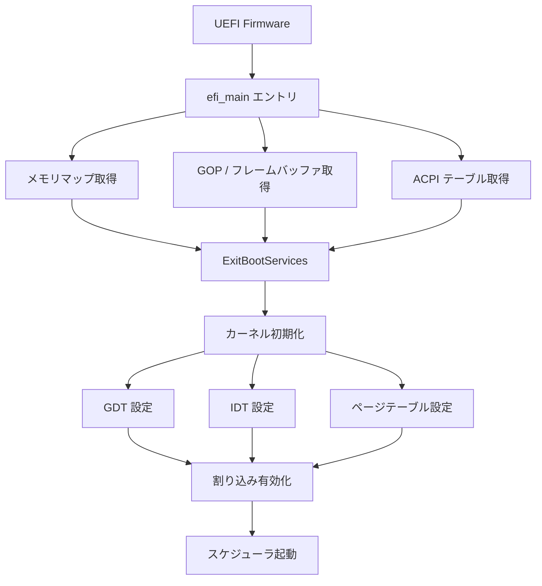

# Cosmos OS 設計ドキュメント

> Cm言語で開発するOS「Cosmos」のアーキテクチャ設計と段階的実装ロードマップ

## 1. 現状の整理

### 既存資産（Cm/examples/uefi）

| ファイル | 機能 |
|---------|------|
| `libs/efi_core.cm` | SystemTable → ConOut / BootServices 取得 |
| `libs/efi_text.cm` | テキスト出力（ASM経由 OutputString） |
| `libs/efi_input.cm` | キー入力（ブロッキング / 非ブロッキング） |
| `libs/efi_memmap.cm` | AllocatePool / FreePool / GetMemoryMap / Stall |
| `libs/efi_gop.cm` | GOP (Graphics Output Protocol) 初期化 |
| `util/graphics.cm` | フレームバッファ描画プリミティブ（Bresenham等） |

### Cmコンパイラの関連機能

- `--target=uefi` ターゲット（PE/COFF出力、`efi_main`エントリポイント）
- インラインASM（`__asm__`）— Win64 ABI呼び出し規約対応
- `no_std` / `no_main` モード（`__cm_alloc`, `__cm_panic` 契約）
- ポインタ演算、型キャスト、構造体
- `lld-link` によるPE/COFFリンク

---

## 2. カーネルアーキテクチャの選択

### 主要パターン比較

| 項目 | モノリシック | マイクロカーネル | ハイブリッド |
|------|-------------|-----------------|-------------|
| **構造** | 全サービスがカーネル空間 | 最小コア＋ユーザ空間サーバ | コアサービスをカーネル、他をユーザ空間 |
| **性能** | ◎ IPC不要 | △ メッセージパッシングのオーバーヘッド | ○ バランス |
| **安全性** | △ 1バグで全体クラッシュ | ◎ 障害分離 | ○ 部分的な分離 |
| **拡張性** | △ カーネル再ビルド必要 | ◎ サーバ追加で拡張 | ○ 柔軟 |
| **複雑度** | ○ 初期は単純 | △ IPC設計が複雑 | △ 境界設計が複雑 |
| **代表例** | Linux | MINIX, seL4, QNX | Windows NT, macOS (XNU) |

### 推奨: **段階的モノリシック → マイクロカーネル移行**

新規OSで最も現実的なアプローチ:

1. **Phase 1-3**: モノリシック構造でコアを実装（GDT/IDT/メモリ管理/タスク）
2. **Phase 4以降**: サービスをユーザ空間に分離し、IPC経由でマイクロカーネル化

> [!TIP]
> Cm の `no_std` + `__asm__` の組み合わせは、低レベルハードウェア操作に十分な機能を提供しています。

---

## 3. 考慮すべき設計要素

### 3.1 ブートプロセス（UEFI → カーネル遷移）



**重要事項:**
- `ExitBootServices()` 後は UEFI Boot Services が**一切使用不可**
- メモリマップは `ExitBootServices()` **前に**取得・保存する必要がある
- UEFIが残すランタイムサービス（NVRAM等）は引き続き利用可能

### 3.2 メモリ管理

**物理メモリ管理:**

| アルゴリズム | 概要 | 適性 |
|-------------|------|------|
| **ビットマップ** | 1ビット/ページで空き管理 | シンプルだが検索がO(n) |
| **フリーリスト** | 空きページのリンクリスト | 高速だがフラグメンテーション |
| **バディシステム** | 2のべき乗でブロック分割・結合 | バランス良好、Linuxでも使用 |

**仮想メモリ管理（ページング）:**

- x86_64は4レベルページテーブル（PML4 → PDPT → PD → PT）
- 初期段階ではアイデンティティマッピング（仮想 = 物理）で十分
- カーネル空間を上位アドレス（e.g., `0xFFFF800000000000`）にマップ

**ヒープアロケータ:**

| アルゴリズム | 概要 | 適性 |
|-------------|------|------|
| **Bump Allocator** | ポインタを進めるだけ | 初期段階向け、解放不可 |
| **Fixed-size Block** | 固定サイズブロックの高速割当 | カーネル内部データ構造 |
| **Slab Allocator** | オブジェクトサイズ別キャッシュ | Linux方式、効率的 |

### 3.3 割り込みとハードウェア抽象化

**GDT（グローバルディスクリプタテーブル）:**
- x86_64 Long ModeではGDTはほぼフラットモデル
- カーネルコード/データセグメント + 将来的なユーザモードセグメント
- TSS（タスクステートセグメント）エントリも必要

**IDT（割り込みディスクリプタテーブル）:**
- 256エントリの割り込みハンドラテーブル
- 例外ハンドラ（0-31）: ゼロ除算、ページフォルト、ダブルフォルト等
- ハードウェア割り込み（32+）: タイマー、キーボード等

**割り込みコントローラ:**
- レガシーPIC（8259A）→ APIC/xAPIC/x2APIC
- UEFI環境では**APIC推奨**（PICはUEFI環境では無効化されている場合がある）
- HPET または APIC Timer でスケジューラティック生成

### 3.4 プロセス/タスク管理

**スケジューリングアルゴリズム:**

| アルゴリズム | 概要 | 複雑度 |
|-------------|------|--------|
| **ラウンドロビン** | タイムスライスで順番に実行 | 低 |
| **優先度付きキュー** | 優先度ベースの実行順序 | 中 |
| **CFS (完全公平スケジューラ)** | 赤黒木ベースの公平分配 | 高（Linux方式） |
| **多層フィードバック** | 動的優先度調整 | 高 |

**初期実装では**ラウンドロビン**が最も適切。**

**タスク状態管理:**
```
CREATED → READY → RUNNING → BLOCKED → READY
                     ↓
                  TERMINATED
```

**コンテキストスイッチ:**
- レジスタの保存/復帰（RSP, RBP, RIP, 汎用レジスタ, フラグ）
- ページテーブルの切り替え（CR3レジスタ）
- TSSのRSP0更新（ユーザ→カーネル遷移用）

### 3.5 デバイスドライバ

**初期必須ドライバ:**

| デバイス | 用途 | インタフェース |
|---------|------|-------------|
| シリアルポート (UART) | デバッグ出力 | I/Oポート (0x3F8) |
| PS/2 キーボード | 入力 | I/Oポート (0x60/0x64) + IRQ1 |
| PIT / APIC Timer | タイマー割り込み | MMIO / MSR |
| GOPフレームバッファ | 画面出力 | メモリマップドI/O |

### 3.6 ファイルシステム（将来）

初期段階では不要。必要になった段階で:
- **initramfs**（メモリ内RAMディスク）から開始
- FAT32（UEFIと互換性があるため最も実用的）
- ext2（シンプルで学習に最適）

---

## 4. 段階的実装ロードマップ

### Phase 1: カーネルブートストラップ  🎯 **v0.1.0 目標**

**目標:** UEFI → ExitBootServices → カーネル起動 → 画面出力

| タスク | 詳細 |
|-------|------|
| ブートローダ改修 | メモリマップ・GOP情報をカーネルに引き渡す構造体定義 |
| ExitBootServices | Boot Services終了、OS側に制御移行 |
| GDT設定 | フラットセグメント（カーネルCS/DS） + ASMによる`lgdt` |
| シリアルコンソール | UART 0x3F8 への出力（デバッグ用） |
| フレームバッファ出力 | GOPから取得したFBに直接描画（既存`graphics.cm`を活用）|

### Phase 2: 割り込みとメモリ管理

**目標:** ハードウェア割り込み応答 + 物理/仮想メモリ管理

| タスク | 詳細 |
|-------|------|
| IDT設定 | 256エントリのIDT + 例外ハンドラ（ASMスタブ + Cmハンドラ） |
| 例外ハンドラ | ゼロ除算、ページフォルト、ダブルフォルト等 |
| PIC/APIC初期化 | 割り込みコントローラの設定 |
| 物理メモリマネージャ | ビットマップまたはバディシステムによるページ管理 |
| ページテーブル | 4レベルページテーブル構築 + CR3設定 |
| ヒープアロケータ | カーネル内malloc/free（Bump → Slab段階移行）|

### Phase 3: タスク管理

**目標:** マルチタスク（カーネルスレッド）

| タスク | 詳細 |
|-------|------|
| タスク構造体 | TCB（タスク制御ブロック）定義 |
| コンテキストスイッチ | ASMによるレジスタ保存/復帰 |
| スケジューラ | ラウンドロビン方式 |
| タイマー割り込み | APIC Timer による定期的なスケジューリング |
| カーネルスレッド | 複数のカーネルタスクの同時実行 |

### Phase 4: ユーザモード（将来）

- Ring 3 への遷移
- システムコールインタフェース（`syscall`/`sysret`）
- ユーザ空間プロセス分離
- IPCメカニズム

---

## 5. ディレクトリ構成案

```
Cosmos/
├── Cm/                      # サブモジュール（コンパイラ）
├── kernel/
│   ├── boot/
│   │   ├── efi_main.cm      # UEFIエントリポイント
│   │   ├── boot_info.cm     # ブート情報構造体
│   │   └── gdt.cm           # GDT設定
│   ├── arch/
│   │   └── x86_64/
│   │       ├── idt.cm       # IDT設定
│   │       ├── pic.cm       # PIC/APIC制御
│   │       ├── paging.cm    # ページテーブル操作
│   │       └── context.cm   # コンテキストスイッチ
│   ├── mm/
│   │   ├── pmm.cm           # 物理メモリマネージャ
│   │   ├── vmm.cm           # 仮想メモリマネージャ
│   │   └── heap.cm          # ヒープアロケータ
│   ├── sched/
│   │   ├── task.cm          # タスク構造体
│   │   └── scheduler.cm     # スケジューラ
│   ├── drivers/
│   │   ├── serial.cm        # UART出力
│   │   ├── keyboard.cm      # PS/2キーボード
│   │   ├── timer.cm         # タイマー
│   │   └── framebuffer.cm   # 画面出力
│   └── lib/
│       ├── string.cm        # 文字列操作
│       └── print.cm         # カーネルprintk相当
├── Makefile
├── VERSION
├── docs/
│   └── os_design.md         # 本ドキュメント
└── .gitignore
```

---

## 6. Cm言語固有の考慮事項

### 利点
- **インラインASM**: `__asm__` でGDT/IDT/CR3操作が直接記述可能
- **型安全性**: ポインタ操作を含む低レベルコードでもCmの型システムが有効
- **no_std**: ランタイム依存を排除した純粋なベアメタルコードが書ける
- **既存資産**: UEFI操作のライブラリが再利用可能

### 制約・注意点
- **グローバル変数**: UEFIバイナリではグローバル変数への書き込みが動作しない（`ExitBootServices`後はこの制約が解除される可能性があるが要検証）
- **構造体レイアウト**: UEFIやハードウェア構造体のオフセットが正確であるか、C ABIとの互換性を確認する必要がある
- **リンカスクリプト**: カーネルのメモリレイアウト（テキスト/データ/BSS/スタック配置）を制御するためにリンカスクリプトが必要になる可能性がある
- **浮動小数点**: カーネル内でFPU/SSE/AVXを使う場合、コンテキスト保存が複雑化する。初期段階では無効化推奨

---

## 7. 参考資料

- [OSDev Wiki](https://wiki.osdev.org/) — OS開発の百科事典
- [Writing an OS in Rust](https://os.phil-opp.com/) — UEFIベースOS開発の優れたチュートリアル
- UEFI Specification — `ExitBootServices`等のAPI仕様
- Intel SDM (Software Developer's Manual) — x86_64アーキテクチャリファレンス
