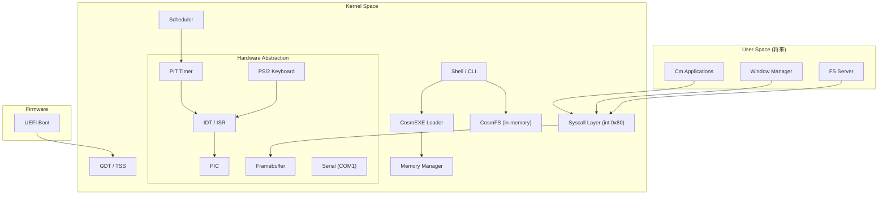

# CosmOS アーキテクチャ設計

> 全てCm言語で書かれた軽量オペレーティングシステム

## 設計理念

| 原則 | 説明 |
|------|------|
| **Pure Cm** | カーネルからユーザランドまで全てCm言語で実装。外部C依存ゼロ |
| **軽量** | 最小限のカーネルフットプリント。メモリ効率を最優先 |
| **段階的進化** | モノリシック → マイクロカーネル → ハイブリッドへの自然な移行 |
| **自己ホスト** | 将来的にCosmOS上でCmコンパイラを動作させ、OS自身をビルド |

## アーキテクチャ概要



## ブートフロー

```
UEFI Firmware
  → efi_main
    → シリアル初期化 (COM1 115200 8N1)
    → GOP/メモリマップ取得
    → ExitBootServices
    → kernel_main
      → GDT/TSS設定
      → PIC初期化 → IDT/ISR登録
      → PMM初期化 (ビットマップ) → ページング有効化
      → ヒープ初期化
      → PIT (100Hz) → スケジューラ起動 → 割り込み有効化
      → PS/2キーボード初期化
      → Syscallハンドラ登録 (vector 0x80)
      → CosmFS初期化 → initramfs展開
      → シェル起動 → アイドルループ
```

## メモリレイアウト

| アドレス | 用途 | サイズ |
|---------|------|--------|
| `0x000–0x0FF` | GDT/セグメント | 256B |
| `0x100–0x8FF` | IDT テーブル | 2KB |
| `0x900–0xBFF` | スケジューラ/PMM状態 | 768B |
| `0xC00–0xCFF` | キーボードバッファ | 256B |
| `0xD00–0xDFF` | シェル/リカバリ状態 | 256B |
| `0xE00–0xFFF` | FBConsole状態 | 512B |
| `0x1000–0x1FFF` | TCB配列 | 4KB |
| `0x7E00000+` | PMM ビットマップ | 動的 |
| `0x7E01000+` | カーネルヒープ | 256KB |

## CosmEXE バイナリ形式

CosmOSの実行バイナリ形式。PEセクションをVAオフセットに配置し、RIPリレーティブアドレッシングを保持。

```
Offset  Size  Field
0x00    8B    Magic: "CosmEXE\0"
0x08    8B    Entry offset (コード先頭からの相対)
0x10    8B    Code size
0x18    8B    Flags (予約)
0x20    ...   Flat binary (VA配置済みセクション)
```

## Syscall ABI

| レジスタ | 用途 |
|---------|------|
| `RAX` | syscall番号 / 戻り値 |
| `RDI` | 第1引数 |
| `RSI` | 第2引数 |
| `RDX` | 第3引数 |

| 番号 | 名前 | 説明 |
|------|------|------|
| `1` | `SYS_WRITE` | `write(fd, buf, len)` |
| `2` | `SYS_READ` | `read(fd, buf, len)` |
| `3` | `SYS_EXIT` | `exit(code)` |

## Cm言語固有の設計考慮

### 利点
- **`__asm__`**: GDT/IDT/CR3操作、コンテキストスイッチを直接記述
- **型安全性**: ポインタ操作を含む低レベルコードでもCmの型システムが有効
- **`no_std`**: ランタイム依存排除の純粋ベアメタルコード
- **PE/COFF出力**: UEFIとの直接互換性

### 制約と対策
| 制約 | 対策 |
|------|------|
| Cmプロローグ自動生成 | iretq前に固定メモリ経由でRSP復元 |
| グローバル変数制限 | 固定メモリアドレスマップ方式 |
| 浮動小数点 | カーネル内ではFPU無効化 |

## 参考資料

- [OSDev Wiki](https://wiki.osdev.org/) — OS開発百科事典
- [Writing an OS in Rust](https://os.phil-opp.com/) — UEFIベースOS開発
- Intel SDM — x86_64アーキテクチャリファレンス
- UEFI Specification — ExitBootServices等のAPI仕様
