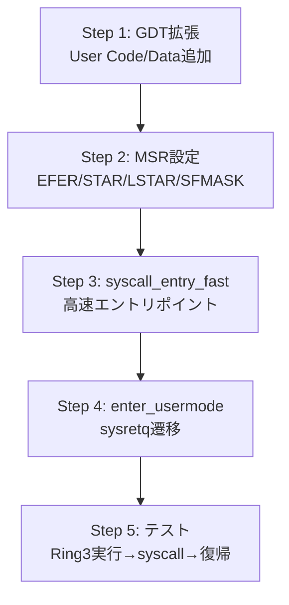

# Ring 3 遷移 設計ドキュメント

> CosmOS v0.2.0 (Isolation) の核心: ユーザモード実行とsyscall/sysret

## 概要

x86_64の特権リング機構を使い、ユーザプロセスをRing 3で実行する。
カーネル（Ring 0）とユーザ空間（Ring 3）を分離し、syscallで安全に切り替える。

```
Ring 0 (カーネル)     Ring 3 (ユーザ)
┌─────────────────┐  ┌─────────────────┐
│  kernel_main     │  │  user_program    │
│  シェル          │  │  (CosmEXE)       │
│  ドライバ        │  │                  │
├─────────────────┤  ├─────────────────┤
│  syscall entry   │←─│  syscall命令     │
│  (LSTAR)         │──→│  sysret復帰     │
└─────────────────┘  └─────────────────┘
```

## 変更ファイル一覧

### 1. GDTの拡張
#### [MODIFY] [gdt.cm](file:///Users/shadowlink/Documents/git/Cosmos/kernel/arch/gdt.cm)

**現在**: 5スロット (Null, Kernel Code, Kernel Data, TSS×2)
**変更後**: 7スロット + TSS

| Index | セレクタ | 用途 |
|-------|---------|------|
| 0 | 0x00 | Null |
| 1 | 0x08 | Kernel Code (Ring 0) |
| 2 | 0x10 | Kernel Data (Ring 0) |
| 3 | 0x18 | User Data (Ring 3) |
| 4 | 0x20 | User Code (Ring 3) |
| 5-6 | 0x28 | TSS (16B) |

> [!IMPORTANT]
> `syscall`/`sysret` は GDT セグメントの配置順序に**厳密な要件**がある:
> - `STAR` MSR の Kernel CS = `0x08` → Kernel SS = `0x08 + 8 = 0x10` (自動)
> - `STAR` MSR の User CS = `User Data + 16` → User SS (自動)
> - **順序**: User Data (0x18) の直後に User Code (0x20) が必要
> - sysret は `STAR.SYSRET_CS + 16` を CS、`STAR.SYSRET_CS` を SS として使用

```
GDT_USER_DATA  = 0x00CFF2000000FFFF  (DPL=3, Data, Writable)
GDT_USER_CODE  = 0x00AFFA000000FFFF  (DPL=3, Code, Long Mode)
GDT_USER_DATA_SEL = 0x18 | 3  = 0x1B  (RPL=3)
GDT_USER_CODE_SEL = 0x20 | 3  = 0x23  (RPL=3)
```

### 2. syscall/sysret MSR設定
#### [NEW] [usermode.cm](file:///Users/shadowlink/Documents/git/Cosmos/kernel/arch/usermode.cm)

MSR レジスタ設定:
- **MSR_EFER** (0xC0000080): SCE (bit 0) をセット → syscall/sysret有効化
- **MSR_STAR** (0xC0000081): `kernel_cs << 32 | user_cs_base << 48`
- **MSR_LSTAR** (0xC0000082): syscallエントリポイントのアドレス
- **MSR_SFMASK** (0xC0000084): syscall時にクリアするRFLAGSビット (IF=0x200)

```
STAR = 0x0018_0008_0000_0000
         ^^^^              → sysret base (0x18: User Data selector base)
              ^^^^          → syscall base (0x08: Kernel Code)
LSTAR = &syscall_entry_fast (新しいsyscallハンドラ)
SFMASK = 0x200 (IFをクリア → syscall中は割り込み無効)
```

### 3. 高速syscallハンドラ
#### [MODIFY] [syscall.cm](file:///Users/shadowlink/Documents/git/Cosmos/kernel/sys/syscall.cm)

`syscall` 命令の動作:
1. RCX ← RIP (復帰アドレス)
2. R11 ← RFLAGS
3. CS ← STAR[47:32] (Kernel Code)
4. SS ← STAR[47:32] + 8 (Kernel Data)
5. RIP ← LSTAR (エントリポイント)

新しいエントリポイント `syscall_entry_fast`:
```
syscall_entry_fast:
    swapgs                  ; GS.base ← カーネルデータ
    mov [gs:rsp_save], rsp  ; ユーザRSPを保存
    mov rsp, [gs:kernel_rsp]; カーネルRSPに切替
    push rcx                ; ユーザRIP保存
    push r11                ; ユーザRFLAGS保存
    push ...                ; callee-savedレジスタ保存
    ; --- Cmのsyscall_dispatch呼出し ---
    pop ...                 ; レジスタ復帰
    pop r11
    pop rcx
    mov rsp, [gs:user_rsp]  ; ユーザRSP復帰
    swapgs
    sysretq
```

> [!WARNING]
> `swapgs` は GS.base の保存が必要。カーネルGS.baseにタスク固有データ（カーネルスタックポインタ等）を保持する。
> 初期実装では `swapgs` の代わりに**固定メモリアドレス**を使って簡略化する。

### 4. ユーザモード遷移
#### [NEW] [usermode.cm](file:///Users/shadowlink/Documents/git/Cosmos/kernel/arch/usermode.cm) (上記と同一ファイル)

`enter_usermode(entry, user_stack)`:
- `sysretq` でユーザ空間に遷移
- RCX = エントリポイント (→ RIP)
- R11 = RFLAGS (IF=1)
- RSP = ユーザスタック

## 実装順序



## 初期実装の簡略化

- **swapgs 省略**: 固定メモリアドレス(0xDA0付近)にカーネル/ユーザRSPを保存
- **ページテーブル分離 後回し**: 全プロセスがカーネルのCR3を共有（identity map）
- **既存 int 0x80 維持**: 移行期間中は両方動作可能に
