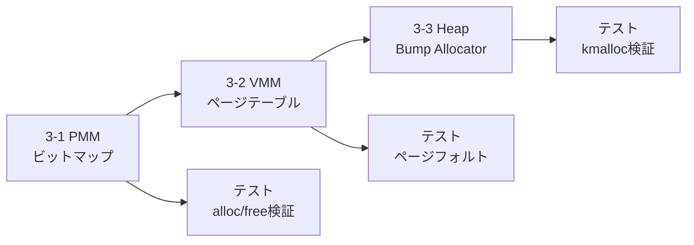

# v0.3.0 スコープ: 物理メモリ管理・ページング・ヒープ

> Phase 2後半: ExitBootServices後の独立メモリ管理基盤の構築

## 概要

v0.2.0で完成した割り込み基盤の上に、メモリ管理の三層構造を構築する:

1. **物理メモリマネージャ (PMM)** — ページフレーム単位の物理メモリ追跡と割当
2. **仮想メモリマネージャ (VMM)** — 4レベルページテーブルによるアドレス変換
3. **ヒープアロケータ** — カーネル内 `malloc`/`free` 相当の動的メモリ割当

## 前提条件（完了済み）

- [x] ExitBootServices完了、UEFIメモリマップ取得済み
- [x] GDT設定・ロード
- [x] IDT/ISR/PIC初期化
- [x] シリアル・デバッグコンソール出力

---

## 実装タスク

### 3-1. 物理メモリマネージャ (PMM)

**方式: ビットマップ方式**

1ビットが1ページ（4KiB）に対応。メモリ効率が高く、実装がシンプル。

| タスク | 詳細 | 状態 |
|-------|------|------|
| UEFIメモリマップ解析 | `EfiConventionalMemory` 領域を抽出 | ✅ |
| ビットマップ配置 | 空き領域にビットマップを確保 | ✅ |
| ページ割当 `pmm_alloc()` | 空きビットを検索して1ページ割当 | ✅ |
| ページ解放 `pmm_free()` | ビットをクリアして解放 | ✅ |
| 統計情報 | 総ページ数、空きページ数の追跡 | ✅ |

**新規ファイル:**
- `kernel/mm/pmm.cm` — 物理メモリマネージャ

> [!IMPORTANT]
> UEFIメモリマップのエントリタイプ:
> - Type 7 (`EfiConventionalMemory`) = OS利用可能
> - Type 0 (`EfiReservedMemoryType`) = 使用禁止
> - Type 3 (`EfiBootServicesCode`) = ExitBS後は再利用可
> - Type 4 (`EfiBootServicesData`) = ExitBS後は再利用可

**ビットマップの鶏と卵問題:**
ビットマップ自体の格納場所を確保するため、UEFIメモリマップのConventionalMemory領域の先頭に配置する。

```
PhysicalMemory:
 [0x0000_0000 - 0x000F_FFFF]  Reserved (Low Memory)
 [0x0010_0000 - ...]          Conventional → ビットマップをここに配置
 [bitmap end  - ...]          Conventional → 以後が割当可能領域
```

### 3-2. 仮想メモリマネージャ (VMM / ページング)

**方式: x86_64 4レベルページテーブル**

```
PML4 → PDPT → PD → PT → 4KiB Page
```

| タスク | 詳細 | 状態 |
|-------|------|------|
| ページテーブル構造体 | PML4/PDPT/PD/PTエントリ定義 | ✅ |
| アイデンティティマップ | UEFI CR3を継承（物理=仮想）| ✅ |
| カーネル空間マップ | 上位アドレス `0xFFFF8000_00000000` にカーネル配置 | 🔮 v0.4.0 |
| CR3設定 | UEFI CR3を読み取り保持 | ✅ |
| ページフォルトハンドラ | ISR #14 でフォルト情報をデバッグ出力 | 🔮 v0.4.0 |

**新規ファイル:**
- `kernel/mm/vmm.cm` — 仮想メモリマネージャ

> [!NOTE]
> 初期段階ではアイデンティティマッピング（物理=仮想）のみ。
> ユーザモード分離はv0.4.0以降。

### 3-3. ヒープアロケータ

**方式: 段階的移行**
1. **Bump Allocator** — 最初の実装（解放不可、シンプル）
2. **Fixed-size Block Allocator** — 固定サイズブロック（将来の拡張）

| タスク | 詳細 | 状態 |
|-------|------|------|
| Bump Allocator | ポインタを進めるだけの単純な割当 | ✅ |
| `alloc()` / `reset_all()` | カーネル内アロケータAPI | ✅ |
| `__cm_alloc` 実装 | Cm no_std 契約の実装 | 🔮 将来 |

**新規ファイル:**
- `kernel/mm/heap.cm` — ヒープアロケータ

> [!TIP]
> `__cm_alloc` を実装することで、Cmの `new` 演算子やコレクション型が
> カーネル空間で使用可能になる（将来）。

---

## v0.3.0に含めないもの

- APIC / x2APIC → v0.4.0以降
- タイマー割り込み → v0.4.0以降
- タスク管理 / スケジューラ → v0.4.0以降
- ユーザモード → Phase 4
- ファイルシステム → Phase 4以降

---

## ディレクトリ構成（v0.3.0追加分）

```
kernel/
├── mm/
│   ├── pmm.cm           # [NEW] 物理メモリマネージャ
│   ├── vmm.cm           # [NEW] 仮想メモリマネージャ
│   └── heap.cm          # [NEW] ヒープアロケータ
├── idt.cm               # [MODIFY] ページフォルトハンドラ強化
├── isr.cm               # [MODIFY] ISR #14 詳細情報出力
└── efi_main.cm          # [MODIFY] kernel_mainにメモリ初期化追加
```

---

## 完了条件

- [x] UEFIメモリマップからConventionalMemory領域を正しく解析できる
- [x] ビットマップPMMでページ割当/解放が動作する
- [x] アイデンティティマップのページテーブルを構築し、CR3にロードできる
- [x] Bump Allocatorで`alloc()`が動作する
- [ ] ページフォルト発生時にフォルトアドレス（CR2）をシリアル出力 → v0.4.0
- [x] `make test` で既存テストが引き続きパスする（11/11 PASS）
- [x] メモリ統計情報（総メモリ/空きメモリ）をシリアル出力

---

## 実装順序



## 技術的注意点

### UEFIメモリマップエントリの解析

```cm
// EFI_MEMORY_DESCRIPTOR は各desc_sizeバイト
// フィールドオフセット（x86_64）:
//   +0:  Type (uint32)
//   +8:  PhysicalStart (uint64)
//   +16: VirtualStart (uint64)
//   +24: NumberOfPages (uint64)
//   +32: Attribute (uint64)
```

### ページテーブルエントリ（PTE）フォーマット

```
Bit 0:    Present (P)
Bit 1:    Read/Write (R/W)
Bit 2:    User/Supervisor (U/S)
Bit 3:    Page-level Write-Through (PWT)
Bit 4:    Page-level Cache Disable (PCD)
Bit 5:    Accessed (A)
Bit 6:    Dirty (D) — PTEのみ
Bits 12-51: Physical Address (4KiB aligned)
Bit 63:   Execute Disable (NX)
```
