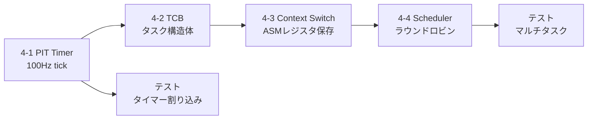

# v0.4.0 スコープ: タイマー・タスク管理・スケジューラ

> Phase 3: マルチタスクカーネルへの進化

## 概要

v0.3.0のメモリ管理基盤の上に、カーネルタスク管理の基礎を構築する:

1. **PIT/APICタイマー** — 定期的なタイマー割り込みでスケジューリングタイミングを生成
2. **タスク構造体 (TCB)** — タスク状態・レジスタ・スタックの管理
3. **コンテキストスイッチ** — ASMによるレジスタ保存/復帰
4. **ラウンドロビンスケジューラ** — 複数カーネルスレッドの協調実行

## 前提条件（完了済み）

- [x] ExitBootServices + UEFIメモリマップ取得（v0.1.0）
- [x] GDT/IDT/ISR/PIC初期化（v0.2.0）
- [x] PMM/VMM/Heap初期化（v0.3.0）
- [x] シリアル・デバッグ・フレームバッファ出力
- [x] テスト: 18/18 PASS (全Cmテスト)

---

## 実装タスク

### 4-1. PIT タイマー（Programmable Interval Timer）

> [!NOTE]
> 初期段階ではレガシーPIT（8254）を使用。APIC Timerはv0.5.0以降。

| タスク | 詳細 | ファイル | 状態 |
|-------|------|---------|------|
| PIT初期化 | Channel 0, Rate Generator, 100Hz | `kernel/drivers/pit.cm` | ✅ |
| IRQ0ハンドラ | ASM直接実装（iretq） | `kernel/drivers/pit.cm` | ✅ |
| tick変数 | 固定アドレス0x900のtickカウンタ | `kernel/drivers/pit.cm` | ✅ |
| PIC IRQ0有効化 | IMRのビット0をアンマスク | `kernel/drivers/pic.cm` | ✅ |

**PIT設定:**
```
I/Oポート:
  0x40: Channel 0 データ
  0x43: コマンドレジスタ

Rate Generator (Mode 2):
  コマンド: 0x34 (Ch0, LSB/MSB, Rate Gen)
  除数: 1193182 / 100 = 11932 (100Hz)
```

### 4-2. タスク構造体 (TCB)

| タスク | 詳細 | ファイル |
|-------|------|---------|
| TCB定義 | タスクID, 状態, RSP, RIP, レジスタ | `kernel/sched/task.cm` |
| スタック割当 | Heapから各タスクにカーネルスタック割当 | `kernel/sched/task.cm` |
| タスク状態 | READY / RUNNING / BLOCKED / TERMINATED | `kernel/sched/task.cm` |

```
TCB (Task Control Block):
  task_id:    ulong          タスク識別子
  state:      ulong          状態（0=Ready, 1=Running, ...）
  rsp:        ulong          保存されたスタックポインタ
  stack_base: ulong          スタック領域先頭
  stack_size: ulong          スタックサイズ
  next:       ulong          次のTCBアドレス（リンクリスト）
```

### 4-3. コンテキストスイッチ

| タスク | 詳細 | ファイル |
|-------|------|---------|
| レジスタ保存 | push rbx,rbp,r12-r15 + rsp保存 | `kernel/sched/context.cm` |
| レジスタ復帰 | rsp復帰 + pop r15-r12,rbp,rbx | `kernel/sched/context.cm` |
| switch_to() | 現タスクのrsp保存 → 次タスクのrsp復帰 | `kernel/sched/context.cm` |

> [!IMPORTANT]
> Cm `__asm__`の出力変数問題（バグ#1）を考慮し、
> ポインタ経由のメモリ読み書きを使用すること。

### 4-4. ラウンドロビンスケジューラ

| タスク | 詳細 | ファイル |
|-------|------|---------|
| タスクリスト | 循環リンクリスト | `kernel/sched/scheduler.cm` |
| schedule() | 次のREADYタスクを選択 | `kernel/sched/scheduler.cm` |
| timer_tick() | タイマー割り込みからschedule()を呼出 | `kernel/sched/scheduler.cm` |
| idleタスク | タスクがない時のHLTループ | `kernel/sched/scheduler.cm` |

---

## 実装順序



## ディレクトリ構成（v0.4.0追加分）

```
kernel/
├── drivers/
│   └── pit.cm             # [DONE] PITタイマードライバ（need_reschedフラグ方式）
├── sched/
│   ├── task.cm            # [DONE] タスク構造体・生成
│   ├── context.cm         # [DONE] コンテキストスイッチ（ASM）
│   └── scheduler.cm       # [DONE] ラウンドロビンスケジューラ
├── isr.cm                 # 既存
├── drivers/pic.cm         # 既存
├── tests/test_scheduler.cm # [DONE] スケジューラテスト（8テスト）
└── efi_main.cm            # [DONE] タイマー+スケジューラ初期化
```

## 完了条件

- [x] PITタイマーが100Hzで割り込み生成（tickカウンタ増加）
- [x] TCB構造体でタスク状態を管理できる
- [x] コンテキストスイッチでレジスタの保存/復帰が正常動作する
- [x] 2つ以上のカーネルスレッドが交互に実行される
- [x] `make test` で既存テスト + スケジューラテストがパスする（26/26 PASS）
- [x] シリアル出力でタスク切り替えのログが確認できる

## v0.4.0に含めないもの

- APIC Timer → v0.5.0以降
- TSS (Task State Segment) → v0.5.0以降（ユーザモード前に必要）
- ユーザモード / Ring3 → Phase 4
- IPC → Phase 4
- ファイルシステム → Phase 4以降

## 技術的注意点

### PITタイマーの注意

- QEMUではPIT割り込みはPIC経由のIRQ0で届く
- PICの初期化でIRQ0をunmaskする必要がある（現在は全IRQ masked）
- ISRのEOI（End of Interrupt）を正しく送信しないと次の割り込みが来ない

### Cmコンパイラのバグ回避

- ローカル配列+ポインタ変数の問題（バグ#7）→ ASM直接構築
- 整数リテラル型推論（バグ#2）→ `as ulong`キャスト
- `__asm__`出力変数の`while`条件問題（バグ#1）→ ポインタ経由書き込み
- **インライン展開によるレジスタ割当変更**（バグ#8）→ `${r:varname}`入力変数構文使用
  - Cmは関数をインライン展開する場合がある。ASM内で`%rdi`/`%rsi`を直接参照すると、インライン時にパラメータが別レジスタ/スタックに配置されるため不正な動作になる。
  - 対策: `${r:varname}`でCmの入力変数をASMレジスタにバインドする
- **インライン展開時のret先不在**（バグ#9）→ `leaq 1f(%rip), %rax; pushq %rax` で復帰アドレスを明示push
  - インライン展開ではcall命令が省略されるためスタック上にreturn addressが無い。`ret`命令実行時に不正アドレスにジャンプしてクラッシュする。
  - 対策: ASM内で明示的にラベルアドレスをpushする（数値ラベル使用）
