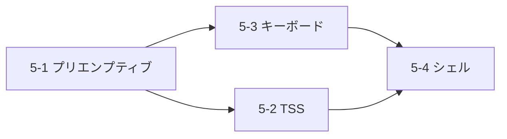

# v0.5.0 スコープ: プリエンプティブスケジューリング・TSS・キーボードドライバ

> Phase 3 完成: タイマー割り込みによる強制タスク切替 + ユーザモード準備

## 概要

v0.4.0の協調スケジューリング基盤の上に、以下を実装する:

1. **プリエンプティブスケジューリング** — タイマー割り込みからの自動コンテキストスイッチ
2. **TSS (Task State Segment)** — カーネルスタック切替の基盤（Ring3移行準備）
3. **PS/2 キーボードドライバ** — IRQ1による入力処理
4. **カーネルシェル** — 基本的なコマンド入力・応答

## 前提条件（完了済み）

- [x] ExitBootServices + UEFIメモリマップ取得（v0.1.0）
- [x] GDT/IDT/ISR/PIC初期化（v0.2.0）
- [x] PMM/VMM/Heap初期化（v0.3.0）
- [x] TCB/スケジューラ/コンテキストスイッチ（v0.4.0）
- [x] PIT 100Hzタイマー割り込み（v0.4.0）
- [x] テスト: 26/26 PASS

---

## 実装タスク

### 5-1. プリエンプティブスケジューリング

> [!IMPORTANT]
> v0.4.0では協調方式（タスクが自発的に`schedule()`呼出し）。
> v0.5.0でタイマー割り込みによる強制切替を実装し、真のマルチタスクを実現。

| タスク | 詳細 | ファイル |
|-------|------|---------|
| IRQ0からのschedule呼出し | タイマー割り込みでneed_reschedフラグ設定、メインループから呼出し | `kernel/drivers/pit.cm` |
| タイムスライス管理 | タスクごとの残りtick管理（デフォルト10tick = 100ms） | `kernel/sched/scheduler.cm` |
| 割り込みコンテキスト保存 | IRQ発生時の全レジスタ保存/復元（ISRフレーム対応） | `kernel/sched/context.cm` |
| idleタスクのHLTループ | idle時はhltで省電力待機、割り込みで起床 | `kernel/sched/scheduler.cm` |

**タイムスライスフロー:**
```
IRQ0 → tick++ → current_task.remaining-- → 0になったらneed_resched=1
                                          → メインループでschedule()
```

### 5-2. TSS (Task State Segment)

> [!NOTE]
> TSSはユーザモード(Ring3)→カーネルモード(Ring0)遷移時にRSP0を設定するために必要。
> v0.5.0でTSSを設置し、v0.6.0以降のユーザモード移行に備える。

| タスク | 詳細 | ファイル |
|-------|------|---------|
| TSS構造体定義 | 104バイトのTSS（RSP0, IST1-7等） | `kernel/tss.cm` |
| GDT拡張 | TSSディスクリプタをGDTに追加（16バイトエントリ） | `kernel/gdt.cm` |
| TSS初期化 | RSP0にカーネルスタックを設定、`ltr`でロード | `kernel/tss.cm` |
| タスク切替時のRSP0更新 | コンテキストスイッチ時に次タスクのカーネルスタックをTSS.RSP0に設定 | `kernel/sched/scheduler.cm` |

### 5-3. PS/2 キーボードドライバ

| タスク | 詳細 | ファイル |
|-------|------|---------|
| スキャンコード読取 | ポート0x60からスキャンコード読取 | `kernel/drivers/keyboard.cm` |
| IRQ1ハンドラ | IDTベクタ33、PIC IRQ1アンマスク | `kernel/drivers/keyboard.cm` |
| スキャンコード→ASCII変換 | US配列キーマップテーブル | `kernel/drivers/keyboard.cm` |
| キーバッファ | リングバッファ（64文字、固定アドレス） | `kernel/drivers/keyboard.cm` |
| PIC IRQ1有効化 | IRQ0(タイマー) + IRQ1(キーボード)のアンマスク | `kernel/drivers/pic.cm` |

### 5-4. カーネルシェル（基本）

| タスク | 詳細 | ファイル |
|-------|------|---------|
| コマンド入力ループ | キーバッファからの読取＋エコー | `kernel/shell/shell.cm` |
| コマンドパーサ | スペース区切りのコマンド解析 | `kernel/shell/shell.cm` |
| 組込みコマンド | `help`, `ps`(タスク一覧), `mem`(メモリ情報), `uptime` | `kernel/shell/commands.cm` |
| シリアル+画面出力 | デバッグポート＋フレームバッファへの出力 | 既存ライブラリ利用 |

---

## ディレクトリ構成（v0.5.0追加分）

```
kernel/
├── tss.cm                   # [NEW] TSS設定
├── gdt.cm                   # [MODIFY] TSSディスクリプタ追加
├── drivers/
│   ├── pit.cm               # [MODIFY] タイムスライス対応
│   ├── pic.cm               # [MODIFY] IRQ1アンマスク
│   └── keyboard.cm          # [NEW] PS/2キーボードドライバ
├── sched/
│   ├── context.cm           # [MODIFY] 割り込みコンテキスト対応
│   └── scheduler.cm         # [MODIFY] プリエンプティブ+タイムスライス
├── shell/
│   ├── shell.cm             # [NEW] カーネルシェル
│   └── commands.cm          # [NEW] 組込みコマンド
└── tests/
    ├── test_keyboard.cm     # [NEW] キーボードテスト
    └── test_tss.cm          # [NEW] TSSテスト
```

## 完了条件

- [ ] タイマー割り込みでタスクが自動的に切り替わる（プリエンプティブ動作確認）
- [ ] TSSが正しく設定されている（`ltr`成功、RSP0が有効）
- [ ] キーボード入力がIRQ1経由で取得できる
- [ ] カーネルシェルで`help`, `ps`, `mem`コマンドが動作する
- [ ] `make test` で既存テスト + 新テストが全パスする
- [ ] `hlt`ループ中にタイマー割り込みとキーボード割り込みが正常処理される

## v0.5.0に含めないもの

- APIC/IOAPIC → v0.6.0以降（PICで十分な段階）
- ユーザモード / Ring3 → v0.6.0
- システムコール → v0.6.0
- ファイルシステム → Phase 4以降
- ネットワーク → Phase 4以降

## 実装優先順位



1. **5-1**: プリエンプティブスケジューリング（最優先 — マルチタスク完成）
2. **5-2**: TSS（GDT拡張が必要、先に実装）
3. **5-3**: キーボードドライバ（独立して実装可能）
4. **5-4**: カーネルシェル（5-2, 5-3完了後）
