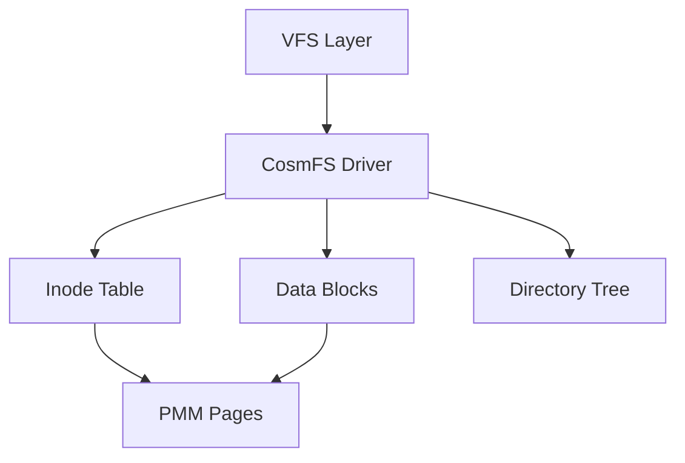

# CosmOS v0.7.0 — ファイルシステム・エディタ・Cmコンパイラ統合

## 概要

CosmOS上に3つの主要機能を段階的に実装する:
1. **CosmFS** — インメモリファイルシステム
2. **Aria** — vim風テキストエディタ（音楽由来命名）
3. **Cm コンパイラ統合** — OS上でのCmソースコンパイル＆実行

> [!IMPORTANT]
> 現在のカーネルにはfree対応ヒープ・文字列ライブラリ・ディスクI/Oが未整備。
> これらの**前提インフラ**を先に構築してから各機能を実装する。

---

## 命名: Aria（アリア）🎵

エディタ名は **Aria** を採用。

| 候補 | 意味 | 採用理由 |
|------|------|---------|
| **Aria** | オペラのソロ歌唱曲 | Cm(ハ短調)の音楽テーマと統一。「一つの声で完結する作品」= 単体で完結するエディタ |
| Cadenza | 独奏即興 | 長い、タイプしにくい |
| Fugue | 対位法 | 音楽性は高いが「混乱」の意味合いも |
| Scherzo | 諧謔曲 | 発音が直感的でない |

**コマンド**: `aria filename.cm` でファイルを開く

---

## 前提条件: 現状のカーネル能力

| 機能 | 状態 | 備考 |
|------|------|------|
| PMM | ✅ | ビットマップ方式、4KBページ |
| VMM | ✅ | アイデンティティマッピング |
| Heap | ⚠️ | Bump allocator（`alloc`のみ、`free`無し） |
| スケジューラ | ✅ | プリエンプティブ・ラウンドロビン |
| キーボード | ✅ | PS/2、ASCII変換、リングバッファ |
| FBConsole | ✅ | ポインタ内包型impl、文字描画 |
| シェル | ⚠️ | 固定128Bバッファ、4コマンド |
| 文字列操作 | ❌ | streqのみ、strlen/memcpy/strcmp等なし |
| ブロックI/O | ❌ | AHCI/VirtIO未実装 |
| ファイルシステム | ❌ | なし |

---

## 実装フェーズ

### Phase 0: 前提インフラ整備（v0.6.1）

FS・エディタ・コンパイラの全てが依存する基盤。

#### 0-1. フリーリスト付きヒープアロケータ

現在のBump Allocatorでは`free`できないため、動的データ構造が作れない。

```
kernel/mm/heap.cm  ← 既存を拡張
```

**設計方針**: ブロックヘッダ付きフリーリスト
- 各割当ブロックの先頭にサイズ情報を格納
- `free()`でフリーリストに返却
- 隣接ブロックの結合（coalescing）は後続フェーズ

#### 0-2. 文字列・メモリ操作ライブラリ

```
kernel/lib/string.cm  [NEW]
```

最低限必要な関数:
- `memcpy`, `memset`, `memmove`
- `strlen`, `strcmp`, `strncmp`
- `strcpy`, `strncpy`
- `memcmp`

全てインラインASMベースで実装（Cmの標準ライブラリは使用不可）。

#### 0-3. カーネルバッファ管理

```
kernel/lib/buffer.cm  [NEW]
```

可変長バッファ（GapBuffer用のプリミティブ）:
- `buf_create(capacity)` → バッファ確保
- `buf_insert(buf, pos, data, len)` → 任意位置挿入
- `buf_delete(buf, pos, len)` → 任意位置削除
- `buf_get(buf, pos)` → 1バイト取得

---

### Phase 1: CosmFS — インメモリファイルシステム（v0.7.0）

> [!TIP]
> 最初はRAMディスク（インメモリFS）として実装。永続化が必要になった段階で
> AHCI/VirtIOドライバ + FAT32/ext2に拡張する。

#### 設計



**VFS（仮想ファイルシステム）層**:

```
kernel/fs/vfs.cm        [NEW]  — ファイル操作API（open/read/write/close）
kernel/fs/cosmfs.cm     [NEW]  — CosmFSドライバ
kernel/fs/path.cm       [NEW]  — パス解析（"/"区切り）
```

**CosmFS仕様**:

| 項目 | 値 |
|------|-----|
| ブロックサイズ | 4KB（PMMページと一致） |
| 最大ファイルサイズ | 初期64KB（16ブロック） |
| ファイル名最大長 | 56バイト |
| ディレクトリエントリ | 64バイト固定（名前56B + inodeID 8B） |
| 最大ファイル数 | 256 |

**VFS API**:

```cm
// ファイル操作
ulong fs_open(void* path, ulong flags);    // → fd
ulong fs_read(ulong fd, void* buf, ulong size);
ulong fs_write(ulong fd, void* data, ulong size);
void  fs_close(ulong fd);

// ディレクトリ操作
ulong fs_mkdir(void* path);
ulong fs_readdir(void* path, void* buf);   // → エントリ数

// ファイル管理
ulong fs_create(void* path);
ulong fs_delete(void* path);
ulong fs_stat(void* path, void* stat_buf);
```

**シェルコマンド追加**:
- `ls [path]` — ディレクトリ一覧
- `cat filename` — ファイル内容表示
- `touch filename` — 空ファイル作成
- `rm filename` — ファイル削除
- `mkdir dirname` — ディレクトリ作成
- `write filename data` — ファイルに書込み

---

### Phase 2: Aria — vim風テキストエディタ（v0.7.0）

#### 設計方針

- **モーダルエディタ**: Normal / Insert / Command の3モード（vim準拠）
- **Gap Buffer**: テキスト保持にGap Buffer方式を採用（挿入/削除がO(1)）
- **FBConsole描画**: 既存のフレームバッファ描画エンジンを再利用
- **ファイルI/O**: CosmFS経由でファイル読み書き

```
kernel/apps/aria/aria.cm         [NEW]  — メインモジュール・起動
kernel/apps/aria/editor.cm       [NEW]  — エディタコア（Gap Buffer + カーソル管理）
kernel/apps/aria/display.cm      [NEW]  — 画面描画（ステータスバー・行番号）
kernel/apps/aria/keymap.cm       [NEW]  — キーマッピング（Normal/Insert/Command）
kernel/apps/aria/command.cm      [NEW]  — コマンドモード（:w, :q, :wq, etc.）
```

#### モードと操作

**Normalモード** (起動時のデフォルト):

| キー | 動作 |
|------|------|
| `h/j/k/l` | カーソル移動（左/下/上/右） |
| `i` | Insertモードに切替 |
| `a` | カーソル後ろからInsertモード |
| `o` | 下に新行挿入 → Insert |
| `x` | 1文字削除 |
| `dd` | 1行削除 |
| `gg` | ファイル先頭 |
| `G` | ファイル末尾 |
| `:` | Commandモードに切替 |

**Insertモード**:

| キー | 動作 |
|------|------|
| 通常文字 | 文字挿入 |
| Backspace | 1文字削除 |
| Enter | 改行挿入 |
| ESC | Normalモードに戻る |

**Commandモード** (`:` で開始):

| コマンド | 動作 |
|---------|------|
| `:w` | ファイル保存 |
| `:q` | 終了（シェルに戻る） |
| `:wq` | 保存して終了 |
| `:q!` | 強制終了（変更破棄） |

#### 画面レイアウト

```
┌──────────────────────────────────┐
│ 1 │ //! platform: uefi            │  ← テキスト領域
│ 2 │ import ./drivers/serial;      │     行番号付き
│ 3 │ █                             │  ← カーソル位置
│ 4 │                               │
│ … │                               │
├──────────────────────────────────┤
│ -- NORMAL --  hello.cm  3,1  3/4 │  ← ステータスバー
│ :                                │  ← コマンドライン
└──────────────────────────────────┘
```

#### Gap Buffer設計

```
メモリレイアウト: [text_before_gap | ...GAP... | text_after_gap]

カーソル移動: gapの位置をシフト（データコピーは最小限）
挿入: gapにデータを書込み、gap startを前進
削除: gap startを後退
```

初期バッファサイズ: 4KB（1ページ）、必要に応じてPMMから追加割当。

---

### Phase 3: Cmコンパイラ統合（v0.8.0）

> [!WARNING]
> Cmコンパイラ（C++実装）をCosmOS上で直接動作させるのは非現実的。
> 代わりに**ホスト側でクロスコンパイルしたバイナリをCosmFSにロード**する方式を採用。

#### 実装戦略: ホストコンパイル + OS上ローダー


**段階的実装**:

1. **Phase 3-1: initramfs ローダー**
   - ビルド時にファイルをメモリイメージに焼き込み
   - ブート時にCosmFSにロード
   - `cm`コマンド → 事前コンパイル済バイナリを実行

2. **Phase 3-2: VirtIO-9Pドライバ**（オプション）
   - ホストのディレクトリをゲスト内でマウント
   - ホスト側で`cm compile`→ゲスト側で即ロード

3. **Phase 3-3: OS上Cmインタープリタ**（将来目標）
   - Cm言語のサブセットインタープリタをCm自身で実装
   - REPL（`cm repl`）対応
   - セルフホスティングへの布石

```
kernel/apps/cm/loader.cm         [NEW]  — バイナリローダー
kernel/apps/cm/initramfs.cm      [NEW]  — initramfsパーサ
kernel/drivers/virtio_9p.cm      [NEW]  — VirtIO-9Pドライバ（Phase 3-2）
kernel/apps/cm/repl.cm           [NEW]  — Cmサブセットインタープリタ（Phase 3-3）
```

---

## 実装優先順位

```mermaid
graph TD
    P0["Phase 0: インフラ"]
    P1["Phase 1: CosmFS"]
    P2["Phase 2: Aria"]
    P3["Phase 3: Cm統合"]

    P0 --> P1
    P1 --> P2
    P1 --> P3
    P2 -.->|"Ariaでファイル編集"| P3

    style P0 fill:#444,stroke:#888
    style P1 fill:#264,stroke:#4a8
    style P2 fill:#246,stroke:#48a
    style P3 fill:#642,stroke:#a84
```



| 順序 | フェーズ | 依存関係 | 推定規模 |
|------|---------|---------|---------|
| 1 | Phase 0: ヒープfree + string.cm + buffer.cm | なし | ~500行 |
| 2 | Phase 1: CosmFS (VFS + ドライバ + シェルコマンド) | Phase 0 | ~800行 |
| 3 | Phase 2: Aria (Gap Buffer + モーダル入力 + 画面描画) | Phase 0 + 1 | ~1000行 |
| 4 | Phase 3-1: initramfs ローダー | Phase 1 | ~300行 |

---

## 検証計画

### Phase 0
- ヒープ: alloc → free → re-alloc で同一アドレス再利用確認
- string: memcpy/strcmp の正当性テスト

### Phase 1
- ファイル作成→書込→読出→削除の一連操作
- ディレクトリ階層のls表示

### Phase 2
- Ariaでファイル作成→テキスト入力→:wq保存→catで内容確認
- Normal/Insert/Command モード切替の正常動作

### Phase 3
- initramfsからファイルをCosmFSにロード
- ロードしたファイルのcat表示
